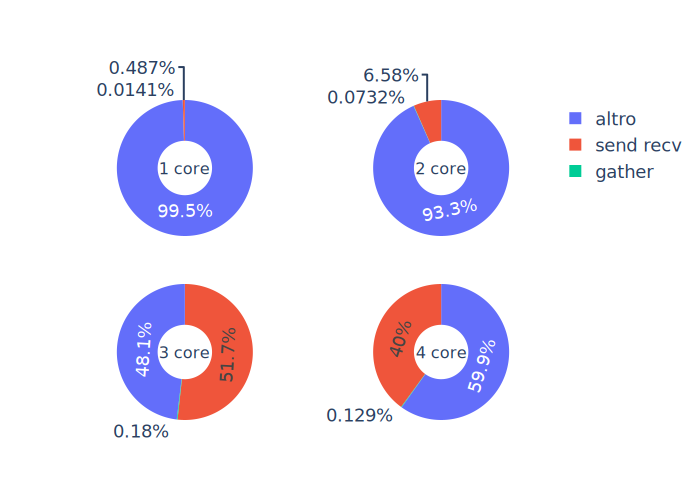

## Modello di Gray-Scott 

::: {style="text-align: left; font-size: 0.9em"}

Modella un processo che consiste **reazioni** e **diffusioni**, descritto tramite un sistema di equazioni.

Descrive la reazione chimica tra due sostanze $U$ e $V$ che si diffondono nello spazio in funzione del tempo. 

Durante la reazione si **consuma** $U$ per **produrre** $V$.

Nella simulazione rappresentiamo le densità $u$ e $v$ nel tempo e nello spazio usando una successione di matrici quadrate.

:::


### I parametri del sistema

In questo modello sono presenti due parametri

::: {style="text-align: left; font-size: 0.75em"}

+ $F$ è il *feeding rate*: regola la velocità con cui $U$ viene reintrodotta  
+ $k$ è il *decay rate*: regola la velocità con cui $V$ viene rimossa

:::

::: {style="font-size: 0.75em"}


Al variare di $F$ e $k$ si ottengono **vari pattern**, alcuni dei quali simili a quelli osservati in **organismi viventi**.

:::


### Le reazioni

Il sistema modella le seguenti **reazioni chimiche**:

::: {style="text-align: left; font-size: 0.75em"}
:::::::::::::: {.columns}
::: {.column width="30%"}
+ $U + 2V \to 3V$
+ $V \to P$  
:::
::: {.column width="70%"}
::: {style="text-align: right;"}
+ $U$ reagisce in $V$ in presenza di $V$ (catalizzatore)
+ $V$ decade in $P$ (sostanza inerte)
:::
:::
::::::::::::::
:::


### Le diffusioni

Le sostanze si **diffondono nello spazio** secondo le velocità di diffusione $D_u$ e $D_v$.

Nel nostro caso $D_u = 2D_v$ per garantire la **formazione di pattern**.


### Le equazioni

Giungiamo ad un **sistema di due equazioni** che descrivono il comportamento dei due reagenti:

::: {style="text-align: center; font-size: 0.75em"}

$\frac{\partial u}{\partial t}=-u v^{2}+F(1-u)+D_{u} \nabla^2 u$

$\frac{\partial v}{\partial t}=u v^{2}-(F+k) v+D_{v} \nabla^2 v$

:::


### Nella simulazione


Il **laplaciano** è valutato **numericamente** secondo la formula

::: {style="font-size: 0.75em"}
$\nabla^2 u_{i, j} \approx u_{i, j-1}+u_{i-1, j}-4 u_{i, j}+u_{i+1, j}+u_{i, j+1}$
:::

<br>


Si ricorre al **metodo di Eulero** per integrare la **derivata temporale**


### {background-video="res/512.mp4"}


# Codice sequenziale {data-transition="zoom"}

. . .

I punti salienti

. . .

::: {style="text-align: center; font-size: 0.75em"}

## Inizializzazione

Inizializziamo **due matrici** che rappresenteranno le **densità** dei due reagenti nello spazio.

Inseriamo in punti a caso delle **concentrazioni non nulle** di $v$

```python
mask = np.random.rand(*shape) < spawn_probability
mask = morphology.dilation(mask, disk(3))

u = np.ones_like(mask)
v = np.zeros_like(mask)

v[mask] = 0.50
```
:::


::: {style="text-align: center; font-size: 0.75em"}

## Laplaciano 

Definiamo la seguente funzione per la valutazione del laplaciano che risolve il problema ai bordi impiegando un **dominio periodico**

```python
def laplacian(r):

    r = np.vstack((r[-1], r, r[0]))
    r = np.vstack((r[:, -1], r.T, r[:, 0])).T

    return (           r[ :-2, 1:-1] +
    r[1:-1, :-2] - 4 * r[1:-1, 1:-1] + r[1:-1, 2:] +
                     + r[2:  , 1:-1] )
```
:::


## Gray-Scott

::: {style="text-align: left; font-size: 0.75em"}

```python

def gray_scott(...):
  ...
  for _ in range(iterations):
    for _ in range(iteration_steps):

      reaction_rate = u * v * v

      u += (u_diff_rate * laplacian(u) -
            reaction_rate + feed_rate * (1 - u))

      v += (v_diff_rate * laplacian(v) +
            + reaction_rate - (feed_rate + decay_rate) * v)

    yield u, v
```
:::


::: {style="text-align: left; font-size: 0.65em"}

Per ogni **iterazione** viene restituito un output, all'interno di ogni interazione avvengono più **passi di evoluzione** del dominio.

L'output consiste nelle matrici $u$ e $v$ aggiornate secondo le variazioni descritte dallo schema numerico.
:::


# Codice parallelo {data-transition="zoom"}

. . .

L'impiego di MPI4PY

. . .

## La parallelizzazione

::: {style="font-size: 0.75em"}


Per rendere il codice sequenziale parallelizzato tramite **MPI** occorre:

::: incremental

+ Eseguire lo **scatter** preliminare delle matrici di partenza
+ Gestire i **send** e i **receive** per la comunicazione dei bordi 
+ Eseguire un **gather** prima di restituire le matrici

:::

:::


### Definizione dei rank

::: {style="font-size: 0.75em"}

Ad ogni core attribuiamo un core **precedente** ed un core **successivo**

- Per i core "**interni**" consideriamo i rank precedenti e successivi

- Per il **primo** core il precedente è l'**ultimo**

- Per l'**ultimo** core il successivo è il **primo**
```python
...
curr_rank = comm.rank
prev_rank = (curr_rank - 1) % comm.size
next_rank = (curr_rank + 1) % comm.size
...
```
> anche perché il dominio è periodico
:::


### Inizializzazione

::: {style="font-size: 0.75em"}

:::::::::::::: {.columns}
::: {.column width="40%"}
<br>
L'inizializzazione è a carico del core con rank 0 che sarà il nostro **master**
:::
::: {.column width="60%"}
```python
def gray_scott_MPI(...):
  ...
  if comm.rank == 0:
      u = u.copy()
      v = v.copy()
  else:
      u = np.empty_like(u)
      v = np.empty_like(v)
  ...
```
:::
::::::::::::::

:::

### Scatter

::: {style="font-size: 0.75em"}

Ripartiamo le matrici del nostro dominio in in **bande orizzontali** di equa dimensione mediante lo scatter del dominio del core 0

A ciascun core è assegnato un **sottodominio** sul quale applicare l'algoritmo

```python
def gray_scott_MPI(...):
  ...
  sub_u = np.empty((height // comm.size, width))
  sub_v = np.empty((height // comm.size, width))

  comm.Scatter(u, sub_u, root=0)
  comm.Scatter(v, sub_v, root=0)
  ...
```
:::


### Laplaciano

::: {style="font-size: 0.75em"}

Occorre modificare il codice per valutare il laplaciano

Gestire il problema ai **bordi** richiede la **comunicazione** tra core **adiacenti**

``` python
def laplacian(r):
  
  comm.Isend(r[0], dest=prev_rank)
  comm.Isend(r[-1], dest=next_rank)

  next_row = np.empty(r[0].shape)
  prev_row = np.empty(r[0].shape)

  comm.Recv(next_row, source=next_rank)
  comm.Recv(prev_row, source=prev_rank)

  r = np.vstack((prev_row, r, next_row))
  r = np.vstack((r[:, -1], r.T, r[:, 0])).T

  return (           r[ :-2, 1:-1] +
  r[1:-1, :-2] - 4 * r[1:-1, 1:-1] + r[1:-1, 2:] +
                   + r[2:  , 1:-1] )
```
:::


## Gray-Scott

::: {style="text-align: center; font-size: 0.75em"}

La funzione per valutare Gray-Scott resta pressocché invariata, basta aggiungere il **gather** delle matrici prima di restituirle


```python

def gray_scott_MPI(. . .):
    . . .
    for _ in range(iterations):
        for _ in range(iteration_steps):

            reaction_rate = sub_u * sub_v * sub_v

            sub_u += (u_diff_rate * laplacian(sub_u) -
                      reaction_rate + feed_rate * (1 - sub_u))

            sub_v += (v_diff_rate * laplacian(sub_v) +
                      + reaction_rate - (feed_rate + decay_rate) * sub_v)

        comm.Gather(sub_u, u, root=0)
        comm.Gather(sub_v, v, root=0)

        if curr_rank == 0:
            yield u.copy(), v.copy()

```

:::


# Valutazione delle performance {data-transition="zoom"}

MacBook Air 2020

Apple Silicon M1, 8 GB RAM, macOS 12.1

+ `iterations = 10`

+ `iteration_steps = 250`

## Tempo impiegato

**<iframe width=730 height=500 src="plots/tempi.html"  ></iframe>**

## Guadagno in velocità

<iframe width=730 height=500 src="plots/speedup.html"  ></iframe>

## Efficienza

<iframe width=730 height=500 src="plots/efficienza.html"  ></iframe>

# Troppi gather? {data-transition="zoom"}

## Tempo impiegato dalle comunicazioni MPI

### Matrici 300x300


### Matrici 400x400


### Matrici 500x500


### Matrici 600x600


### Matrici 700x700


# Considerazioni sul tipo di dato {data-transition="zoom"}

## Float 32 vs Float 64

I **grafici precedenti** sono il risultato dell'utilizzo di matrici di tipo **float a 32 bit**.

Prove preliminari utilizzando dei **float a 64 bit** portavano a dei **risultati inaspettati**.

## Tempi di calcolo

:::::::::::::: {.columns}
::: {.column width="50%"}
float 32

:::
::: {.column width="50%"}
float 64

:::
::::::::::::::


## Guadagno in velocità

:::::::::::::: {.columns}
::: {.column width="50%"}
float 32

:::
::: {.column width="50%"}
float 64

:::
::::::::::::::


### Efficienza

:::::::::::::: {.columns}
::: {.column width="50%"}
float 32

:::
::: {.column width="50%"}
float 64

:::
::::::::::::::

## Considerazioni

Le operazioni con **float 64** impiegano circa il **doppio del tempo** rispetto a quelle con **float 32**.

A parità di dimensioni, una matrice **float 64** occupa il **doppio della memoria** rispetto ad una di tipo **float 32**.

## Considerazioni

Arrivato ad un certo punto assistiamo ad un **peggioramento sostanziale**:

È evidente con le matrici **600x600** e **700x700**, nelle esecuzioni con **3** e **4** core

## Comunicazioni troppo impegnative?

### Tempo impiegato dalle comunicazioni 600x600

:::::::::::::: {.columns}
::: {.column width="50%"}
float 32

:::
::: {.column width="50%"}
float 64

:::
::::::::::::::

### Tempo impiegato dalle comunicazioni 700x700

:::::::::::::: {.columns}
::: {.column width="50%"}
float 32

:::
::: {.column width="50%"}
float 64

:::
::::::::::::::

## Alcune teorie

Ad esempio, una riga inviata o ricevuta può occupare $700$ celle $\times$ $64$ bit = $44.800$ bit = $5.600$ byte

+ Considerando il mio processore Apple Silicon M1:

  - Larghezza di banda UMA: 68.25 GB/s

  - Cache di primo livello: 192 KB 

# Conclusioni {data-transition="zoom"}

. . . 

L'impiego di **MPI** in una simulazione di un sistema **Gray-Scott** risulta **valido** per accelerare le elaborazioni, anche sul mio semplice **personal computer**.

. . .

## Riferimenti

+ [Gray-Scott Model of a Reaction-Diffusion System, Katharina Käfer, Mirjam Schulz](https://itp.uni-frankfurt.de/~gros/StudentProjects/Projects_2020/projekt_schulz_kaefer/)

+ [Reaction-Diffusion by the Gray-Scott Model: Pearson's Parametrization, Robert Munafo](https://mrob.com/pub/comp/xmorphia/)

+ [Gray-Scott Model, Pierre Navaro](https://pnavaro.github.io/python-fortran/06.gray-scott-model.html)


